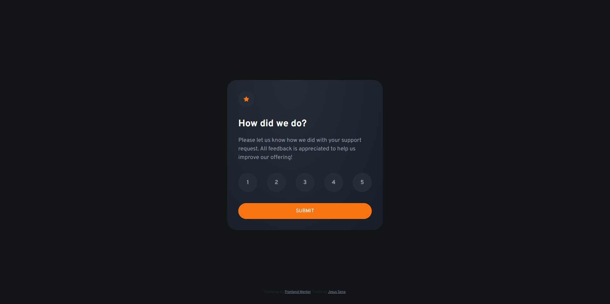

# Interactive Rating Component

[Check out the live project here]([https://your-project-link](https://senajesus.github.io/interactive-rating-frontend/))

## Welcome! 👽

This project is the implementation of an interactive rating component as part of a challenge proposed by Frontend Mentor. The component allows users to rate a service and provide feedback about their experience. With a modern design and an intuitive user experience, the component offers a simple and effective way to collect ratings. The project was developed using HTML, CSS, and advanced front-end techniques to create an elegant and functional solution. It's a great opportunity to enhance my development skills and learn more about creating interactive components.

## Table of Contents

- [Overview](#overview)
  - [Features](#features)
  - [Screenshot](#screenshot)
- [My Process](#my-process)
  - [Built With](#built-with)
  - [What I Learned](#what-i-learned)

## Overview

The goal of this project is to create an interactive rating component that allows users to rate a service on a scale from 1 to 5. The component features star icons that can be selected to indicate the desired rating. After selection, users have the option to submit their rating. The responsive design ensures a consistent experience across mobile and desktop devices.

### Features

- Interactive display of star icons for rating.
- Option to submit the rating.
- Responsive design adaptable to different devices.

### Screenshot

## My Process

During the development of this project, I followed a mobile-first approach to ensure that the component was visually appealing and functional on mobile devices. I used semantic HTML and custom CSS to create the structure and style the component according to the challenge guidelines. For interactivity and event handling, I incorporated JavaScript into the project to enable the rating selection and submission functionality.

### Built With

- Semantic HTML5 markup
- Custom CSS properties
- Flexbox
- Mobile-first workflow
- JavaScript for interactivity and event handling

### What I Learned

This project provided an opportunity to enhance several skills and learn important concepts. Here are some of the key takeaways from the development process:

- Implementation of an interactive rating component using HTML and CSS.
- Understanding the principles of responsive design and creating a layout that adapts to different devices.
- Use of star icons and custom styling to achieve the desired appearance.
- Application of specific styles to elements using classes and selectors.
- Event handling in JavaScript to enable user interaction with the component.
- Improvement in code organization and project structure.
- Strengthening knowledge of version control using Git.
